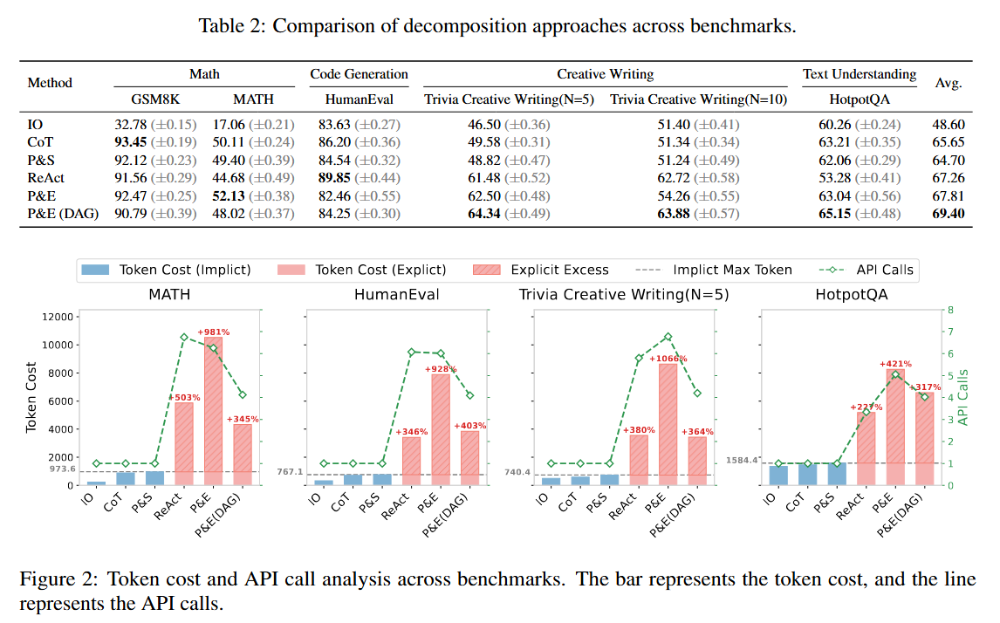
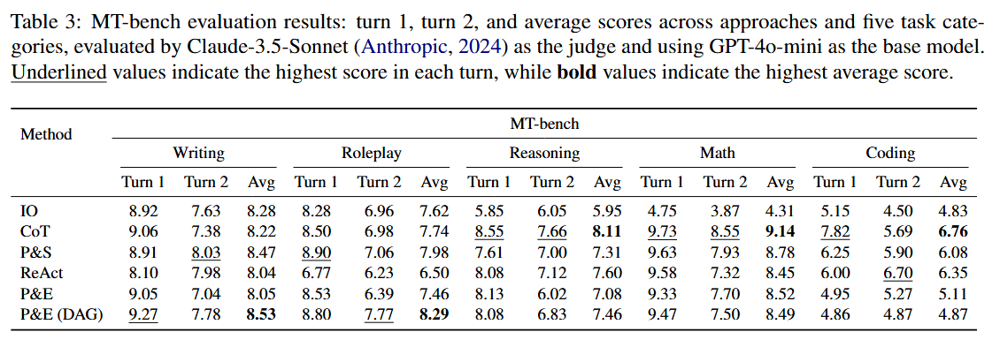
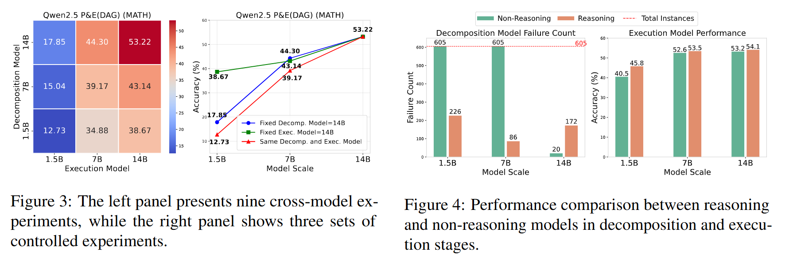

# Select-Then-Decompose: From Empirical Analysis to Adaptive Selection Strategy for Task Decomposition in Large Language Models.

---
## 📰 News

-🎉 Updates (2025-9-15) Our paper is accepted for oral presentation!
-🚩 Updates (2025-8-21) Our paper is accpected to EMNLP 2025 Main!

## 👋🏻 Literature Review

Recent work has explored how large language models (LLMs) perform task decomposition to enhance reasoning and problem-solving. Existing methods can be broadly categorized along three core dimensions (colored):

-Decomposition–first vs. interleaved, depending on whether reasoning is planned before or during execution (e.g., Plan-and-Solve vs. ReAct).

-Implicit vs. explicit, referring to whether decomposition happens within a single LLM call or through multi-step prompting (e.g., CoT vs. Plan-and-Execute).

-Linear vs. DAG structures, determining whether subtasks form a sequential chain or a graph that supports parallel execution.


## 📊 Empirical Analysis

### Performance-Cost Dilemma



**Takeaway I**: The existing task decomposition approaches are confronted with a performance-cost dilemma.

### The Relationship between Tasks and Approaches



**Takeaway II**: Task characteristics determine the sequence, calling form, and topology of task decomposition.

### Impact of Model Discrepancies



**Takeaway III**: Scaling the execution model yields greater performance gains than scaling the decomposition model, with the reasoning model further enhancing the execution stage.

## 🚀 Setup

1. Clone the repository:
   ```bash
   git clone https://github.com/summervvind/Select-Then-Decompose.git
   cd Select-Then-Decompose
2. Create and activate a virtual environment
    ```bash
    conda create -n {env_name} python=3.10
    pip install -r requirements.txt
3. Install the fastchat for Mt-bench. 
    ```bash
    git clone https://github.com/lm-sys/FastChat.git
    cd FastChat
    pip install -e ".[model_worker,llm_judge]"
4. Set api_key and base_url
    ```
    Set your API_KEY and BASE_URL in openai_call.py and utils.py

## 🏃 Get Started
Run the run.py script for evaluting any method on any benchmark.
    
### 🔧 Example Usage

```bash
python run.py \
    --model gpt-4o-mini \
    --method cot \
    --dataset GSM8K \
    --max_tokens 2048 \
    --temperature 0.0 \
    --parallel_num 10 \
    --is_test True

python run.py \
    -model gpt-4o-mini \
    --method select_then_decompose \
    --dataset GSM8K \
    --max_tokens 2048 \
    --temperature 0.0 \
    --parallel_num 10 \
    --is_test True \ 
    --confidence_threshold 0.7
```
---

### ⚙️ Hyperparameters

The following command-line arguments can be used to configure the task decomposition experiment.

| Argument | Type | Default | Choices | Description |
|----------|------|---------|---------|-------------|
| `--model` | `str` | `gpt-4o-mini` | - | Base model used for the experiment. |
| `--plan_model` | `str` | `None` | - | Model for **planning** phase (defaults to `--model` if not specified). |
| `--execute_model` | `str` | `None` | - | Model for **execution** phase (defaults to `--model` if not specified). |
| `--max_tokens` | `int` | `2048` | - | Maximum number of tokens generated per response. |
| `--temperature` | `float` | `0.0` | - | Sampling temperature (higher → more randomness). |
| `--method` | `str` | `cot` | `io`, `cot`, `ps`, `react`, `linear_flow`, `dag_flow`, `select_then_decompose` | Reasoning method. |
| `--dataset` | `str` | `GSM8K` | `GSM8K`, `Multiarith`, `MATH`, `HumanEval`, `HotpotQA`, `Trivia_Creative_Writing`, `MT_Bench`, `DROP` | Dataset used for experiments. |
| `--parallel_num` | `int` | `1` | - | Number of parallel API calls. |
| `--is_test` | `bool` (`true/false`) | `False` | - | Whether to run in test mode. |
| `--category` | `str` | `writing` | `writing`, `roleplay`, `extraction`, `math`, `coding`, `reasoning`, `stem`, `humanities` | Category for `MT_Bench` experiment (ignored for other benchmarks). |
| `--confidence_threshold` | `float` | `0.7` | - | Validation threshold for `select_then_decompose` method. |


```

